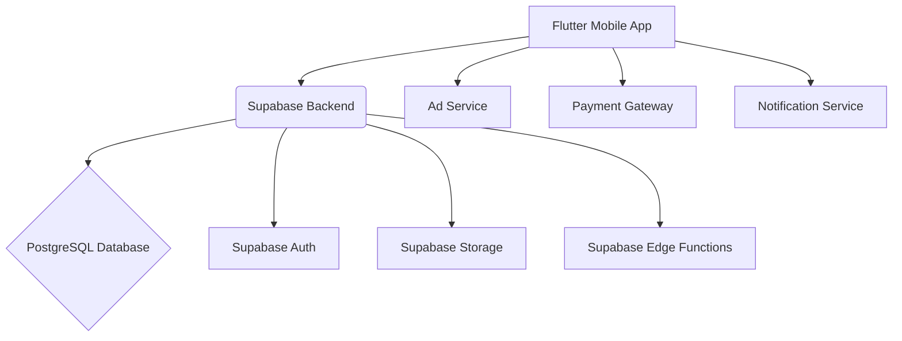

# System Patterns

## Architecture Overview
Dincharya follows a client-server architecture, with a Flutter-based mobile application as the client and Supabase providing the backend services (database, authentication, storage, edge functions).

## Key Technical Decisions
- **Flutter Framework:** Chosen for cross-platform development (iOS, Android, Web, Desktop) from a single codebase, ensuring consistency and faster development.
- **Supabase:** Selected as the backend-as-a-service (BaaS) for its real-time database capabilities, integrated authentication, and ease of use with Flutter.
- **Provider/Riverpod (or similar state management):** Likely used for efficient and scalable state management within the Flutter application. (To be confirmed/detailed in `techContext.md`)
- **Modular Design:** The application is structured into distinct modules (e.g., `presentation`, `services`, `models`, `core`) to promote maintainability and scalability.

## Design Patterns in Use
- **Repository Pattern:** Abstracting data sources (Supabase, local storage) to provide a clean API for data access.
- **Service Layer:** Encapsulating business logic and interactions with external services (Auth, Payment, Ads, Notifications).
- **MVC/MVVM (or similar for UI):** Separation of concerns within the `presentation` layer for UI, logic, and data binding. (To be confirmed/detailed in `techContext.md`)

## Component Relationships
- **Authentication:** `auth_service.dart` interacts with `Supabase Auth` for user management.
- **Data Management:** Various services (e.g., `local_tasks_service.dart`) interact with the Supabase database.
- **UI Components:** Widgets in `presentation` layer consume data and services provided by other layers.

## Critical Implementation Paths
- **User Onboarding & Authentication Flow:** Ensuring a smooth and secure sign-up/login experience.
- **Routine Synchronization:** Handling offline capabilities for local tasks and syncing with the backend when online.
- **Payment Processing:** Secure and reliable integration with payment gateways.
- **Real-time Updates:** Utilizing Supabase's real-time features for dynamic content updates (e.g., admin changes).
